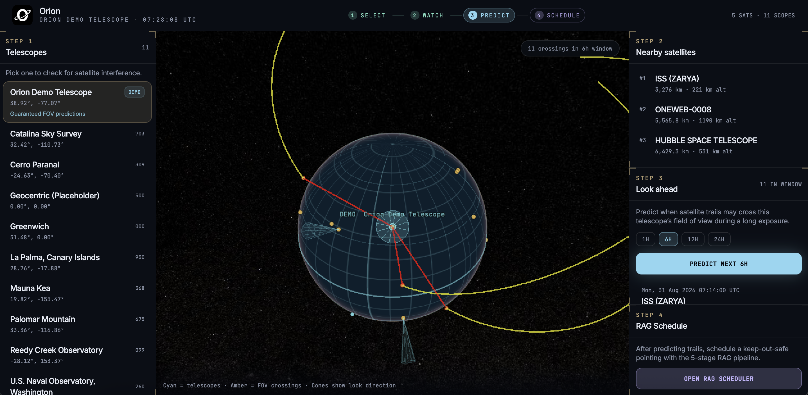
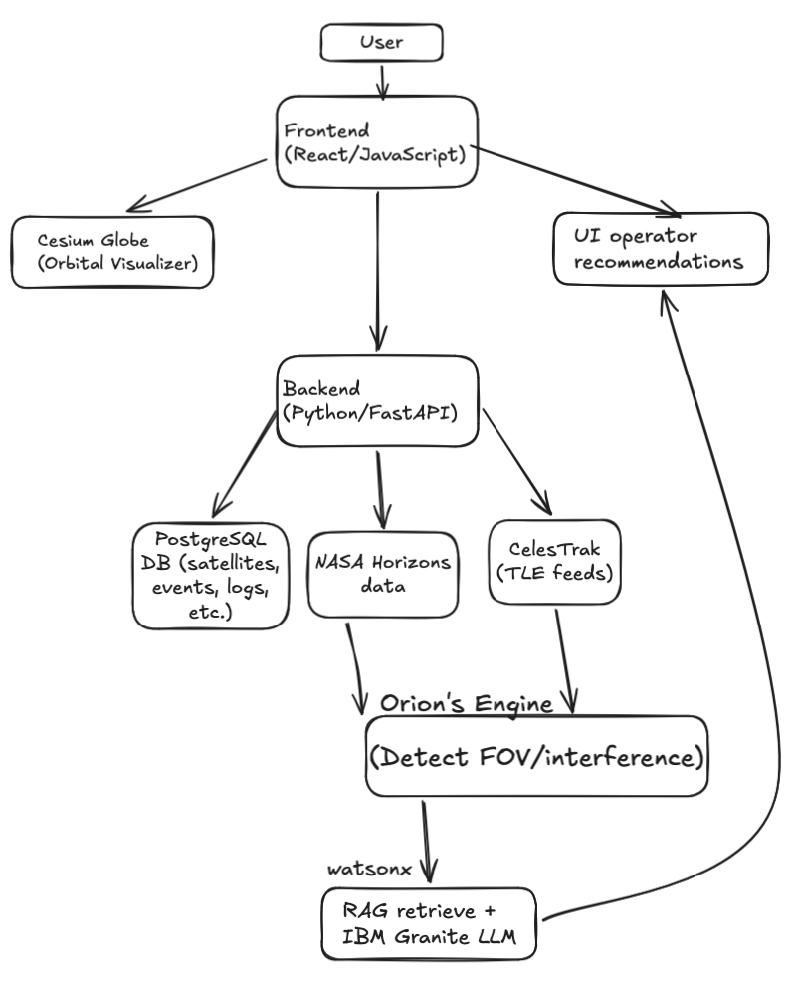

# Orion



The screenshot above is a **fully populated catalog** (CelesTrak TLEs on the globe). A local run with live data looks like this. If CelesTrak is unreachable, the demo telescope still works with a small fallback set (ISS, Hubble, JWST, Starlink, OneWeb), so nearby/predict/RAG stay usable—just with far fewer objects on the globe.

### The issue

Currently, there are around 16,000 satellites orbiting Earth. By 2030, this figure is projected to reach 100,000, and by 2040, it will soar to 560,000. Even now, telescopes are experiencing "photobombs"—streaks of light in images caused by reflections from passing satellites.

### Our solution

Orion solves this problem by analyzing satellite and telescope data, mapping trajectories, and predicting exactly when these "photobombs" will occur. Orion can also issue movement commands to reorient telescopes, keeping their images clear. Additionally, a RAG pipeline processes contextual data to track nearby cosmic events, ensuring telescopes do not inadvertently steer away from crucial astronomical phenomena.



## Workflow

1. **Select** — choose a telescope (the **Orion Demo Telescope** is first and always works).
2. **Watch** — nearby satellites sorted by 3D distance.
3. **Predict** — FOV crossing scan over a 1h / 6h / 12h / 24h window.
4. **Schedule** — RAG scheduler. On the demo telescope, RA/Dec are overridden to a keep-out-safe zenith field so the walkthrough completes even without watsonx or live catalogs.

## Stack

| Layer | Tech |
| --- | --- |
| Frontend | React, Vite, Cesium / Resium, Tailwind |
| Backend | FastAPI, SQLAlchemy (async), PostgreSQL, SGP4 |
| Data | CelesTrak TLEs, JPL Horizons (JWST), STScI MAST, IBM watsonx Granite |

## Local setup

**Requirements:** Python 3.12+, Node 20+, PostgreSQL.

Create a database (default user/db `orion` / `orion`):

```bash
createdb orion   # or create role/db to match DATABASE_URL
```

**Backend**

```bash
cd backend
python3 -m venv .venv
source .venv/bin/activate
pip install -r requirements.txt
# set DATABASE_URL in backend/.env (see env vars below)
uvicorn main:app --reload --host 127.0.0.1 --port 8000
```

On startup Orion creates tables, seeds the demo telescope + fallback TLEs, then refreshes CelesTrak / Horizons in the background.

**Frontend**

```bash
cd frontend
npm install
npm run dev
```

App: [http://localhost:5173](http://localhost:5173) (proxies `/api` to port 8000).  
API: [http://127.0.0.1:8000](http://127.0.0.1:8000) · docs at `/docs`.

Optional seed scripts: `python seed.py` (catalog rows), `POST /api/tle/seed` (static TLEs if CelesTrak is down).

## Environment variables

| Name | Required | Notes |
| --- | --- | --- |
| `DATABASE_URL` | Yes | `postgresql+asyncpg://…` |
| `WATSONX_API_KEY` | For live Granite | IBM Cloud IAM key |
| `WATSONX_PROJECT_ID` | For live Granite | watsonx.ai project GUID |
| `WATSONX_URL` | No | Default `https://us-south.ml.cloud.ibm.com` |
| `TLE_CACHE_TTL_HOURS` | No | Default `6` |

Without watsonx, Stage 4 falls back to ranked keep-out-safe slots. The demo RAG path still approves a maneuver.

## RAG pipeline

`POST /api/rag/schedule`

1. MAST cone search + Guide Star Catalog  
2. Sun / Moon keep-out vectors (HST-style 50° / 10° defaults)  
3. Context builder (dither grid + safe slots)  
4. Granite (or heuristic if keys are missing)  
5. Telemetry validation (coordinates, keep-out, Earth limb, contamination, confidence)
